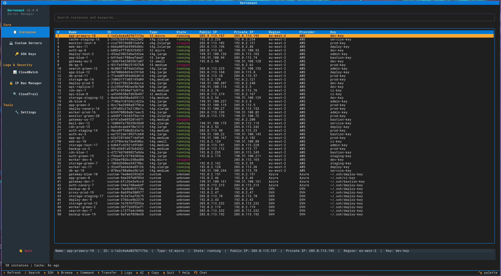
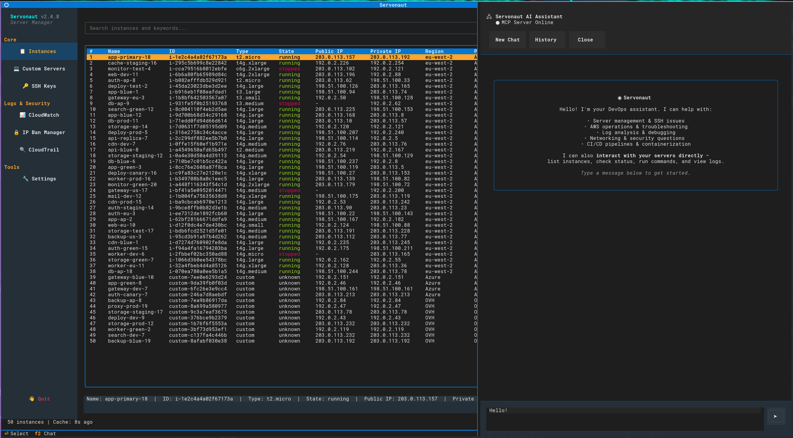

# Servonaut

A modern Terminal User Interface (TUI) for managing servers — SSH, SCP, scanning & more.

## Quick Install

**Linux / macOS:**

```bash
curl -sSL https://raw.githubusercontent.com/zb-ss/ec2-ssh/master/install.sh | bash
```

**Windows (PowerShell):**

```powershell
irm https://raw.githubusercontent.com/zb-ss/ec2-ssh/master/install.ps1 | iex
```

**Or install directly via pipx / pip:**

```bash
pipx install servonaut
```

**Manual install from source:**

```bash
git clone https://github.com/zb-ss/ec2-ssh.git
cd ec2-ssh
pipx install .
```

## Screenshots


*Instance list with sidebar navigation, detail panel, and server metadata*


*Built-in AI assistant with MCP server integration for DevOps tasks*

## Features

- **Interactive TUI** with mouse and keyboard support powered by [Textual](https://textual.textualize.io/)
- **List and search** EC2 instances across all AWS regions
- **Custom servers** — add non-AWS servers from any provider (DigitalOcean, Hetzner, on-prem, etc.) with full SSH/SCP support
- **SSH into instances** — launches in new terminal window with auto-detected emulator
- **Run remote commands** via overlay panel with real-time streaming output, persistent history, and saved command favorites
- **Browse remote file systems** — interactive file tree navigation
- **SCP file transfer** — upload/download files and directories
- **Real-time log viewer** — stream remote logs via `tail -f` with pause, search, and log switching
- **Keyword-based server scanning** — search file contents across instances
- **CloudTrail event browser** — browse AWS CloudTrail events with filters for region, time range, event name, and user
- **CloudWatch Logs browser** — browse AWS CloudWatch log groups with Top IPs analysis, IP geolocation lookup, and AbuseIPDB integration
- **IP ban manager** — ban IPs via AWS WAF, Security Groups, or NACLs with audit trail
- **AI log analysis** — analyze logs with OpenAI, Anthropic, or Ollama (local) with cost estimation
- **MCP server** — expose Servonaut tools to AI agents (Claude Code, etc.) with guard system and audit trail
- **Bastion host / jump server support** via ProxyJump or ProxyCommand
- **SSH key management** with auto-discovery and per-instance configuration
- **Instance caching** with stale-while-revalidate for fast startup
- **Auto-update check** — notifies of new versions on startup, one-click update from the menu or `servonaut --update`
- **Desktop shortcut** — `servonaut --install-desktop` adds an app launcher entry (Linux/macOS)
- **Fully configurable** — all settings in `~/.servonaut/config.json`

## Prerequisites

- Python 3.10+
- AWS CLI configured (`~/.aws/credentials` and `~/.aws/config`)
- SSH client (standard on Linux/macOS, OpenSSH on Windows)
- `pipx` for isolated installation (recommended)

Your AWS credentials need `ec2:DescribeInstances` and `ec2:DescribeRegions` permissions. Additional permissions needed for optional features:

| Feature | Required Permissions |
|---------|---------------------|
| CloudTrail browser | `cloudtrail:LookupEvents` |
| IP ban (WAF) | `wafv2:GetIPSet`, `wafv2:UpdateIPSet` |
| IP ban (Security Groups) | `ec2:AuthorizeSecurityGroupIngress`, `ec2:RevokeSecurityGroupIngress`, `ec2:DescribeSecurityGroups` |
| IP ban (NACLs) | `ec2:CreateNetworkAclEntry`, `ec2:DeleteNetworkAclEntry`, `ec2:DescribeNetworkAcls` |
| CloudWatch Logs | `logs:DescribeLogGroups`, `logs:FilterLogEvents` |

## Usage

```bash
servonaut                  # Launch the TUI
servonaut --debug          # Launch with debug logging to stderr
servonaut --update         # Check for updates and upgrade
servonaut --install-desktop # Create desktop shortcut (Linux/macOS)
servonaut --mcp            # Start as MCP server (for AI agents)
servonaut --mcp-install    # Auto-install MCP server into Claude Code
```

### Keyboard Shortcuts

| Context | Key | Action |
|---------|-----|--------|
| Main Menu | `U` | Update Servonaut (when update available) |
| Global | `Q` | Quit |
| Global | `?` | Help screen |
| Global | `Escape` | Go back / close |
| Instance List | `/` | Focus search |
| Instance List | `R` | Force-refresh from AWS |
| Instance List | `S` | SSH to selected instance |
| Instance List | `B` | Browse remote files |
| Instance List | `C` | Run command overlay |
| Instance List | `T` | SCP transfer |
| Instance List | `Y` | Copy IP to clipboard |
| Global | `F2` | Toggle AI chat panel |
| Anywhere | Mouse drag | Select text (auto-copies to clipboard) |
| Anywhere | `Ctrl+C` | Copy selected text |
| Command Overlay | `Ctrl+C` | Stop running command |
| Command Overlay | `Ctrl+R` | Command picker (saved + recent) |
| Command Overlay | `Ctrl+S` | Save command to favorites |
| Command Overlay | `Up/Down` | Command history |
| Log Viewer | `P` | Pause/resume streaming |
| Log Viewer | `C` | Clear output |
| Log Viewer | `F` | Find/search in output |
| Log Viewer | `L` | Switch log file |

### What You Can Do

**Main Menu:**
1. **List Instances** — View all EC2 + custom servers with search/filter
2. **Manage SSH Keys** — Configure default and per-instance SSH keys
3. **Scan Servers** — Run keyword scans across running instances
4. **Custom Servers** — Add/edit/remove non-AWS servers
5. **CloudTrail Logs** — Browse AWS CloudTrail events with filters
6. **IP Ban Manager** — Ban IPs via WAF, Security Groups, or NACLs
7. **CloudWatch Logs** — Browse AWS CloudWatch log groups with Top IPs analysis, action filter (All/Allowed/Blocked), IP geolocation and abuse lookup (`i`)
8. **Settings** — Configure all application settings including AI provider and AbuseIPDB API key

**Server Actions** (after selecting an instance):
Browse Files, Run Command, SSH Connect, SCP Transfer, View Scan Results, View Logs (tail -f), AI Analysis, Ban IP

Command history persists across sessions — use `Ctrl+R` to search history and saved commands, `Ctrl+S` to save favorites.

### Instance Caching

| Scenario | Behavior |
|----------|----------|
| First launch (no cache) | Fetches from AWS with progress indicator |
| Restart within TTL (default 1h) | Instant load from cache |
| Restart after TTL | Shows stale data immediately, refreshes in background |
| Press `R` | Force-refresh from AWS |

### Configuration

All configuration lives in `~/.servonaut/config.json`, created automatically on first run.

See [Configuration Guide](docs/configuration.md) for the full reference including connection profiles, scan rules, and match conditions.

**Secrets:** API keys in `config.json` support `$ENV_VAR` and `file:~/.secrets/key` syntax so the config file stays secret-free. You can also create `~/.secrets/servonaut.env` with `KEY=value` pairs — loaded automatically on startup.

### Optional Dependencies

```bash
# AI log analysis (OpenAI, Anthropic, Ollama)
pipx inject servonaut httpx
# or: pip install 'servonaut[ai]'

# MCP server for AI agents
pipx inject servonaut mcp
# or: pip install 'servonaut[mcp]'

# Install everything
pip install 'servonaut[all]'
```

### MCP Server for AI Agents

Servonaut includes an integrated MCP server that exposes tools to AI agents like Claude Code:

```bash
# Auto-install into Claude Code
servonaut --mcp-install

# Run MCP server manually (stdio transport)
servonaut --mcp
```

**Available tools:** `list_instances`, `run_command`, `get_logs`, `check_status`, `get_server_info`, `transfer_file`

**Guard levels:** `readonly` (list/status only), `standard` (read + safe commands), `dangerous` (all operations). Dangerous commands (`rm -rf`, `shutdown`, `reboot`, etc.) are always blocked regardless of guard level. All operations are logged to `~/.servonaut/mcp_audit.jsonl`.

### Set Up with an AI Agent

Paste this prompt into Claude Code, Cursor, or any AI coding assistant to get Servonaut installed and configured automatically:

<details>
<summary>Copy-paste setup prompt</summary>

```
Install and configure Servonaut, a TUI for managing servers.

1. Install: `pipx install servonaut` (or `pip install servonaut`)
2. Install optional deps: `pipx inject servonaut httpx mcp` (for AI analysis + MCP server)
3. Run `servonaut` once to generate ~/.servonaut/config.json
4. Read ~/.servonaut/config.json and help me configure:
   - AWS regions to scan (default scans all, set `regions` array to limit)
   - Default SSH username (`default_username`, default "ec2-user")
   - Cache TTL (`cache_ttl_seconds`, default 3600)
   - Terminal emulator if not auto-detected (`terminal_emulator`)
5. If I use bastion/jump hosts, help me set up `connection_profiles` and `connection_rules`
6. If I have non-AWS servers, help me add them to `custom_servers`
7. If I want AI log analysis, help me configure `ai_provider` (openai/anthropic/ollama)
   - API keys support $ENV_VAR syntax so they don't go in the config file
8. Install MCP server into Claude Code: `servonaut --mcp-install`

After setup, launch with `servonaut` and walk me through the key features.
```

</details>

## Development

```bash
# Run directly (primary dev workflow)
PYTHONPATH=src python3 -m servonaut.main

# Run with debug logging
PYTHONPATH=src python3 -m servonaut.main --debug

# Install editable
pip install -e .

# Update pipx installation after changes
pipx install . --force
```

```bash
# Run tests
pip install -e ".[test]"
pytest
```

See [Architecture](docs/architecture.md) for codebase structure and design patterns.

## Troubleshooting

See [Troubleshooting Guide](docs/troubleshooting.md) for help with SSH connections, bastion hosts, key management, and AWS credentials.

## Runtime Files

All runtime files are under `~/.servonaut/`:

| File | Purpose |
|------|---------|
| `config.json` | Main configuration |
| `cache.json` | Cached instance list |
| `keywords.json` | Scan results store |
| `command_history.json` | Saved commands and command history |
| `ip_ban_audit.json` | IP ban audit trail |
| `mcp_audit.jsonl` | MCP server audit trail |
| `logs/servonaut.log` | Application log |

## Logging

Logs are always written to `~/.servonaut/logs/servonaut.log`. Use `--debug` for verbose stderr output.

When SSH fails, the terminal window stays open showing the error and exit code.

## License

This project is licensed under the MIT License — see the [LICENSE](LICENSE) file for details.
