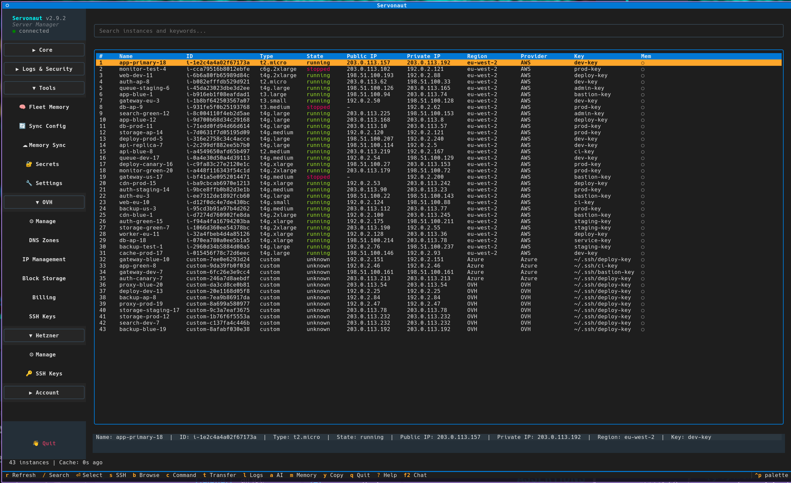

# Servonaut

<!-- mcp-name: dev.servonaut/servonaut -->

**Your servers. Your terminal. Your AI agent. One TUI.**

Manage AWS, Hetzner, OVH, and custom servers from one terminal — with a built-in AI assistant and MCP server.


## Quick Install

**Linux / macOS:**

```bash
curl -sSL https://raw.githubusercontent.com/zb-ss/servonaut/master/install.sh | bash
```

**Windows (PowerShell):**

```powershell
irm https://raw.githubusercontent.com/zb-ss/servonaut/master/install.ps1 | iex
```

**Or install directly via pipx / pip:**

```bash
pipx install servonaut
```

**Manual install from source:**

```bash
git clone https://github.com/zb-ss/servonaut.git
cd servonaut
pipx install .
```

### Set up with an AI agent

Prefer to let an AI agent do the whole thing? Paste this prompt into Claude Code, Cursor, or any coding assistant — it installs Servonaut, generates the config, and walks you through AWS / SSH / bastion / custom-server / AI-provider setup plus the MCP server.

<details>
<summary><b>Copy-paste setup prompt</b></summary>

```
Install and configure Servonaut, a TUI for managing servers (AWS EC2, OVHcloud, Hetzner Cloud, and custom SSH servers).

1. Install with all optional features: `pipx install 'servonaut[all]'`
   (bundles the MCP server + OVH/Hetzner SDKs + keyring; AI log analysis needs no extra. Use plain `pipx install servonaut` for a minimal install.)
2. Run `servonaut` once to generate ~/.servonaut/config.json
3. (Optional) If I have a Servonaut account, run `servonaut login` to unlock the hosted features: Servonaut AI (chat with my fleet, no local API key), config sync across machines, Memory Sync, and proactive monitoring (Findings). Servonaut works fully offline against my own credentials if I skip this.
4. Read ~/.servonaut/config.json and help me configure:
   - AWS regions to scan (default scans all, set `regions` array to limit)
   - Default SSH username (`default_username`, default "ec2-user")
   - Cache TTL (`cache_ttl_seconds`, default 3600)
   - Terminal emulator if not auto-detected (`terminal_emulator`)
5. If I use bastion/jump hosts, help me set up `connection_profiles` and `connection_rules`
6. If I have non-AWS servers, help me add them to `custom_servers`
7. If I use OVHcloud or Hetzner Cloud, help me add the API credentials so those instances merge into the fleet
8. For AI log analysis or chat with my own model (instead of Servonaut AI), help me configure `ai_provider` (openai/anthropic/gemini/ollama)
   - Each provider has its own key field (`openai_api_key`, `anthropic_api_key`, `gemini_api_key`, `ollama_api_key`); local Ollama needs none
   - Key fields support `$ENV_VAR` and `file:~/.secrets/key` syntax so secrets stay out of the config file
9. Install the MCP server into my coding agent: `servonaut --mcp-install claude` (or `cursor`, `windsurf`, `opencode`, `vscode`, `all`)
10. (Optional) To let AI agents/teammates reach this machine over the relay — and to run proactive Findings scans — start it with `servonaut connect`

After setup, launch with `servonaut` and walk me through the key features, including the Findings inbox if I enabled the hosted features.
```

</details>

## Screenshots

<details>
<summary><b>📸 More screenshots</b> — CloudWatch Top IPs, IP banning, AI chat, sidebar, instance list</summary>


*Instance list — AWS, Hetzner, OVH, and custom servers merged into one view*


*Sidebar reveals Fleet Memory, Memory Sync, Secrets, Settings, and per-provider management for OVH and Hetzner*


*Built-in AI assistant with MCP server integration — chat with local providers or hosted Servonaut AI*


*CloudWatch log browsing with Top IPs analysis, geolocation, and abuse scoring*


*Ban/unban IPs via WAF, Security Groups, or NACLs with audit trail*

All screenshots and the launch video were recorded with `--demo` active, which replaces real IPs, ARNs, paths, and secrets with safe fake equivalents. See [docs/demo-mode.md](docs/demo-mode.md) for what is redacted and how to use it.

</details>

## Features

*Badges: **Solo+** = included with paid Solo/Teams plans.*

### Core & connectivity

- **Interactive TUI** — mouse + keyboard, powered by [Textual](https://textual.textualize.io/).
- **Multi-provider fleet** — AWS EC2, OVHcloud (dedicated / VPS / Public Cloud), Hetzner Cloud, and custom servers from any provider (DigitalOcean, on-prem, …) — listed and searchable in one view across all regions.
- **Per-instance dashboard** — click a server for a Server Actions view: a **memory snapshot** (OS, disk, web stack, databases, runtimes, containers) plus an opt-in **live resource monitor** (`L` — CPU / RAM / load / disk / uptime, polled only while open).
- **SSH & SCP** — one-key SSH in a new terminal window (auto-detected emulator); upload/download files and directories.
- **Run remote commands** — overlay panel with real-time streaming output, history, and saved favorites.
- **Remote file browser** — interactive file-tree navigation, inline in the dashboard or full-screen.
- **Real-time log viewer** — stream logs via `tail -f` with pause, search, and log switching.
- **Robust SSH** — bastion / jump-server (ProxyJump / ProxyCommand), keepalives on by default (tunable), per-host `extra_ssh_options` for legacy boxes, and key auto-discovery.

### Cloud provider management

- **OVHcloud** — `OVH → ⚙ Manage`: create / start / stop / reboot / delete (Cloud / VPS / dedicated), a region-first create wizard with API-backed pricing, plus DNS, IP blocks & failover IPs, snapshots, block storage, and billing.
- **Hetzner Cloud** — `Hetzner → ⚙ Manage`: full lifecycle + project SSH-key registry, with an equivalent CLI (`servonaut hetzner …`). Auto-registers new servers. → [docs](docs/hetzner.md)

### Observability & security

- **Proactive monitoring — Findings** *(Solo+)* — cloud-side detectors surface fleet issues (disk, failed services, slow queries, credential-scanning cross-referenced with fail2ban, container health, TLS expiry, pending updates) as triageable cards, with **gated one-click remediation** (server-signed preview → human confirm → verb-allowlisted executor; block IP or renew a cert). → [guide](docs/proactive-monitoring.md)
- **CloudWatch Logs browser** — log groups with Top-IPs analysis, IP geolocation, and AbuseIPDB lookups.
- **CloudTrail browser** — AWS CloudTrail events with region / time / event / user filters.
- **IP ban manager** — ban IPs via AWS WAF, Security Groups, or NACLs, with an audit trail.
- **Keyword server scanning** — search file contents across instances.

### AI

- **Servonaut AI** *(Solo+)* — hosted AI gateway; chat with your fleet with no local API key. The model can tail logs, run commands (with confirmation), and triage incidents over the relay — credentials and SSH keys never leave the CLI. Quota inline / `servonaut ai quota`.
- **Bring your own key** — OpenAI / Anthropic / Gemini / Ollama keys configured per-provider in Settings → AI Provider (local Ollama needs none). All coexist with Servonaut AI, switchable per-session.
- **Built-in AI chat** — LLM assistant with tool-calling against your instances (the same MCP tool surface below).
- **AI log analysis** — analyze logs with OpenAI, Anthropic, Gemini, or Ollama, with cost estimation.
- **Voice input** — dictate into the chat panel with `ctrl+t`. Transcribed entirely on your machine, so audio never leaves the workstation. Two engines: a batch one, or a streaming one that shows words as you speak. Opt-in — nothing is downloaded until you enable it in Settings. → [docs](docs/voice-input.md)

### Memory & secrets

- **Server memory** — persistent per-server cache of OS / runtime / service / web-stack / log / database / container / git / disk facts; optional background fleet auto-scan. → [docs](docs/memory.md)
- **Memory Sync** *(Solo+)* — end-to-end-encrypted backup of fleet memory to servonaut.dev (X25519 + AES-256-GCM, your passphrase), with drift detection, cross-device history, and optional auto-sync. `☁ Memory Sync` in the sidebar.
- **Database credential vault** *(Solo+)* — scan a server for the DB credentials its apps already use, store the password in your secret vault under a per-site label, and let the `db_*` tools resolve it by name — no password in config or agent context. → [docs](docs/db-credential-vault.md)

### Agents & automation (MCP)

- **MCP server** — ~80 tools for Claude Code, Cursor, Windsurf, etc.: instance ops, AWS / Hetzner / OVH lifecycle, S3, log analysis & IP banning, Docker inspection, system-health probes, SSH-key CRUD, memory queries, and an authenticated REST proxy — behind a three-tier guard (`readonly` / `standard` / `dangerous`) with a JSONL audit trail. → [details below](#mcp-server-for-ai-agents)
- **MCP relay** — `servonaut connect` (or TUI autostart) holds a Mercure SSE connection open so agents and team-mates can dispatch tool calls to this machine. Tokens never leave the CLI.
- **Servonaut Cloud account** — optional `servonaut login` unlocks config sync across machines and the MCP relay.
- **Config sync** — client-side-encrypted snapshots of your `config.json` synced via servonaut.dev, paired with a passphrase you control.

### Convenience

- **Instance caching** — stale-while-revalidate for fast startup.
- **Auto-update** — startup check + one-click update (`servonaut --update`).
- **Desktop shortcut** — `servonaut --install-desktop` (Linux/macOS).
- **Fully configurable** — everything in `~/.servonaut/config.json`.

## Prerequisites

- Python 3.10+
- AWS CLI configured (`~/.aws/credentials` and `~/.aws/config`)
- SSH client (standard on Linux/macOS, OpenSSH on Windows)
- `pipx` for isolated installation (recommended)

Your AWS credentials need `ec2:DescribeInstances` and `ec2:DescribeRegions` permissions. Additional permissions needed for optional features:

| Feature | Required Permissions |
|---------|---------------------|
| CloudTrail browser | `cloudtrail:LookupEvents` |
| IP ban (WAF) | `wafv2:GetIPSet`, `wafv2:UpdateIPSet` |
| IP ban (Security Groups) | `ec2:AuthorizeSecurityGroupIngress`, `ec2:RevokeSecurityGroupIngress`, `ec2:DescribeSecurityGroups` |
| IP ban (NACLs) | `ec2:CreateNetworkAclEntry`, `ec2:DeleteNetworkAclEntry`, `ec2:DescribeNetworkAcls` |
| CloudWatch Logs | `logs:DescribeLogGroups`, `logs:FilterLogEvents` |
| OVHcloud (optional) | OVH API credentials — 3-key (application key / secret / consumer key) or OAuth2. Set up via `servonaut --setup-ovh` or in Settings. |

## Getting Started

```bash
servonaut
```

That's the whole interface. The TUI is the primary and recommended way to
use Servonaut — every feature (fleet view, SSH, remote commands, logs,
IP banning, AI chat, server memory, provider management) is reachable from
the sidebar, with full mouse and keyboard support.

A few flags you may want on day one:

```bash
servonaut --update                # Check for updates and upgrade
servonaut --install-desktop       # Create desktop shortcut (Linux/macOS)
servonaut --setup-ovh             # Guided OVHcloud credential setup
servonaut --debug                 # Verbose logging to stderr
```

**Headless & automation:** every major feature also has a scriptable CLI
(`servonaut connect`, `servonaut memory`, `servonaut ai`,
`servonaut hetzner`, `servonaut secrets`) for CI runners, cron jobs, and
boxes without an interactive session — see the
[CLI Reference](docs/cli-reference.md). Wiring up an AI agent instead?
Jump to [MCP Server for AI Agents](#mcp-server-for-ai-agents).

### Keyboard Shortcuts

| Context | Key | Action |
|---------|-----|--------|
| Main Menu | `U` | Update Servonaut (when update available) |
| Global | `Q` | Quit |
| Global | `?` | Help screen |
| Global | `Escape` | Go back / close |
| Instance List | `/` | Focus search |
| Instance List | `R` | Force-refresh from AWS |
| Instance List | `S` | SSH to selected instance |
| Instance List | `B` | Browse remote files |
| Instance List | `C` | Run command overlay |
| Instance List | `T` | SCP transfer |
| Instance List | `Y` | Copy IP to clipboard |
| Server Actions | `L` | Toggle the live resource monitor |
| Server Actions | `1`–`8` | Run the numbered action (Browse, Command, SSH, …) |
| Server Actions | `Esc` | Close inline view, or go back |
| Global | `F2` | Toggle AI chat panel |
| Anywhere | Mouse drag | Select text (auto-copies to clipboard) |
| Anywhere | `Ctrl+C` | Copy selected text |
| Command Overlay | `Ctrl+C` | Stop running command |
| Command Overlay | `Ctrl+R` | Command picker (saved + recent) |
| Command Overlay | `Ctrl+S` | Save command to favorites |
| Command Overlay | `Up/Down` | Command history |
| Log Viewer | `P` | Pause/resume streaming |
| Log Viewer | `C` | Clear output |
| Log Viewer | `F` | Find/search in output |
| Log Viewer | `L` | Switch log file |

### What You Can Do

The TUI opens to a unified instance list (AWS + OVH + Hetzner + custom servers in one searchable table). The collapsible left sidebar groups everything else by purpose:

**Core**
- **📋 Instances** — search and SSH the unified fleet
- **💻 Custom Servers** — add / edit / remove non-AWS servers (DigitalOcean, on-prem, etc.)
- **🔑 SSH Keys** — configure default and per-instance keys

**Logs & Security**
- **📊 CloudWatch** — browse AWS log groups with Top IPs analysis, action filter (All/Allowed/Blocked), IP geolocation, AbuseIPDB lookup
- **🔒 IP Ban Manager** — ban IPs via WAF, Security Groups, or NACLs
- **🔍 CloudTrail** — audit AWS API activity with filters

**Tools**
- **🧠 Fleet Memory** — scan / refresh / inspect the AI-queryable fact cache, with an optional scheduled background auto-scan (bulk scans run in the background and survive leaving the panel)
- **☁ Memory Sync** — encrypted backup of fleet memory across devices (Solo+)
- **🛡 Findings** — proactive-monitoring inbox: scan, review, and triage server-detected issues fleet-wide (Solo+; Free shows an upgrade card)
- **🔄 Sync Config** — encrypted config snapshots (Solo+)
- **🔧 Settings** — configuration, scan rules, AI provider, AbuseIPDB key

**OVH** (visible when configured)
- **⚙ Manage** — table of OVH instances with state-aware lifecycle toolbar (Create / Start / Stop / Reboot / Delete)
- **🔑 SSH Keys** — project-level SSH key registry (the one the create wizard injects from)
- DNS Zones · IP Management · Block Storage · Billing

**Hetzner** (visible when configured)
- **⚙ Manage** — table of Hetzner servers with full lifecycle toolbar (Create / Power on / Shutdown / Reboot / Delete)
- **🔑 SSH Keys** — Hetzner Cloud project SSH key registry

**Account**
- Login · Teams · Bug Reports

**Server Actions** — clicking any instance row opens a per-instance dashboard: the detail pane shows the server's identity, a memory snapshot, and an opt-in live resource monitor (`L`), and the action rail covers:

- Browse Files (inline) · Run Command · SSH Connect · SCP Transfer
- View Scan Results · View Logs (`tail -f`) · AI Analysis · Findings (`F`)
- Ban IP · Manage/Verify SSH Ref

The **SSH Ref** editor pairs with a Bitwarden vault — pick an SSH key from a list instead of pasting a UUID, or import keys straight from `~/.ssh` (passphrase-protected included), so a machine with no local keys can still connect. The TUI, CLI, and MCP agents all resolve the key from your vault at connect time *(Solo+)*. → [docs](docs/bitwarden-ssh.md)

Command history persists across sessions — `Ctrl+R` to search history and saved commands, `Ctrl+S` to save favorites.

### Instance Caching

| Scenario | Behavior |
|----------|----------|
| First launch (no cache) | Fetches from AWS with progress indicator |
| Restart within TTL (default 1h) | Instant load from cache |
| Restart after TTL | Shows stale data immediately, refreshes in background |
| Press `R` | Force-refresh from AWS |

### Configuration

All configuration lives in `~/.servonaut/config.json`, created automatically on first run.

See [Configuration Guide](docs/configuration.md) for the full reference including connection profiles, custom servers, scan rules, and match conditions.

**SSH keepalives:** all connections send keepalives by default so long or idle agent-driven sessions don't get dropped. Tune globally via the `ssh` block in `config.json` (`server_alive_interval`, `server_alive_count_max`, `tcp_keepalive`, `connect_timeout`).

**Legacy / special-case SSH hosts:** connection profiles and custom servers both accept an `extra_ssh_options` array that appends arbitrary `-o KEY=VALUE` flags per host — use it to talk to ancient OpenSSH boxes (`HostKeyAlgorithms=+ssh-rsa`), override keepalives, or set connect timeouts without weakening your global SSH defaults. See [Per-host SSH tuning](docs/configuration.md#per-host-ssh-tuning).

**Secrets:** API keys in `config.json` support `$ENV_VAR` and `file:~/.secrets/key` syntax so the config file stays secret-free. You can also create `~/.secrets/servonaut.env` with `KEY=value` pairs — loaded automatically on startup.

### Optional Dependencies

```bash
# MCP server for AI agents
pipx inject servonaut mcp
# or: pip install 'servonaut[mcp]'

# Hetzner Cloud / OVHcloud provider SDKs
pip install 'servonaut[hetzner]'
pip install 'servonaut[ovh]'

# Voice input — dictate into the AI chat panel, transcribed locally
pip install 'servonaut[voice]'            # batch engine
pip install 'servonaut[voice-streaming]'  # live text as you speak

# Install everything
pip install 'servonaut[all]'
```

Voice input also needs the PortAudio system library (`sudo apt install
libportaudio2`, `brew install portaudio`) and a one-time model download,
both surfaced in Settings → AI → Voice Input. See
[docs/voice-input.md](docs/voice-input.md).

AI log analysis (OpenAI, Anthropic, Gemini, Ollama) needs no extra install —
`httpx` ships as a base dependency.

### MCP Server for AI Agents

> This section is for wiring up AI agents (Claude Code, Cursor, Windsurf, …) —
> not day-to-day interactive use. If you're a human operating your fleet,
> the TUI above is the recommended interface.

Servonaut includes an integrated MCP server that exposes tools to AI agents like Claude Code:

```bash
# Auto-install into a coding agent
servonaut --mcp-install claude     # Claude Code
servonaut --mcp-install cursor     # Cursor
servonaut --mcp-install windsurf   # Windsurf
servonaut --mcp-install opencode   # OpenCode
servonaut --mcp-install vscode     # VS Code Copilot
servonaut --mcp-install all        # All of the above

# Run MCP server manually (stdio transport)
servonaut --mcp
```

#### Agent-only / headless install

You don't need the TUI to use Servonaut as an agent toolbox. The MCP server
runs fully headless — `servonaut --mcp` never loads the terminal UI (this is
enforced by a regression test), so you can install it on a server or CI box
purely as an MCP backend for your coding agent:

```bash
pipx install 'servonaut[mcp]'
servonaut --mcp-install claude   # or cursor, windsurf, opencode, vscode, all
```

Configure credentials and servers the same way as a TUI install (
`~/.servonaut/config.json`, `$ENV_VAR` / `file:` secret syntax — see
[Configuration Guide](docs/configuration.md)). For Servonaut Cloud features
(relay, config sync, hosted AI), `servonaut login` runs the device-flow
sign-in fully headless — approve from a browser on any device. Everything an
agent does goes through the same guard levels and is logged to
`~/.servonaut/mcp_audit.jsonl`.

**SSH keys from Bitwarden (no keys on the box).** If your instances have a
[Bitwarden SSH ref](docs/bitwarden-ssh.md) saved, the SSH-backed tools
(`run_command`, `get_logs`, `transfer_file`, …) resolve the private key from
your vault at connect time instead of needing it in `~/.ssh` — so an agent on a
fresh server or CI box can connect with no local keys at all. Because a headless
process can't prompt for your master password, unlock the vault once and export
the session into the environment the MCP server (or `servonaut connect`) runs
in:

```bash
export BW_SESSION=$(bw unlock --raw)   # unlock once; stays valid until you `bw lock` or the shell exits
servonaut --mcp                         # child inherits BW_SESSION
```

The key is written to a private, `0600` temporary file only for the duration of
each command and deleted immediately after. If the vault is locked or `bw` isn't
installed, the tools fall back to local keys — a working local setup is never
affected.

**Available tools:**

| Category | Tools |
|----------|-------|
| Instance ops | `list_instances`, `check_status`, `get_server_info`, `run_command`, `get_logs`, `transfer_file` |
| AWS observability & security | `cloudwatch_list_log_groups`, `cloudwatch_get_log_events`, `cloudwatch_top_ips`, `cloudtrail_lookup_events`, `ip_ban_list_configs`, `ip_ban_list_banned`, `ip_ban_set` |
| Server memory | `get_server_memory`, `list_server_memories`, `build_server_memory`, `refresh_server_memory` |
| Session / backend | `whoami`, `api_request` |
| Relay | `relay_status`, `relay_reconnect`, `mcp_tool_call` |
| Hetzner Cloud | `hetzner_list_servers`, `hetzner_list_server_types`, `hetzner_list_ssh_keys`, `hetzner_create_ssh_key`, `hetzner_delete_ssh_key`, `hetzner_create_server`, `hetzner_delete_server`, `hetzner_power_on`, `hetzner_power_off`, `hetzner_shutdown`, `hetzner_reboot` |
| OVHcloud | `ovh_monitoring`, `ovh_list_ips`, `ovh_firewall_rules`, `ovh_ssh_keys`, `ovh_snapshots`, `ovh_dns_records`, `ovh_billing`, `ovh_invoices`, `ovh_create_instance`, `ovh_delete_instance`, `ovh_start_instance`, `ovh_stop_instance`, `ovh_reboot_instance` |
| AWS EC2 | `aws_list_regions`, `aws_list_amis`, `aws_list_instance_types`, `aws_list_key_pairs`, `aws_list_subnets`, `aws_list_security_groups`, `aws_start_instance`, `aws_stop_instance`, `aws_reboot_instance`, `aws_terminate_instance`, `aws_run_instances` |
| S3 / Object Storage | `s3_list_buckets`, `s3_list_objects`, `s3_download_object`, `s3_create_bucket`, `s3_delete_bucket`, `s3_upload_object`, `s3_delete_object`, `s3_copy_object`, `s3_move_object`, `s3_generate_presigned_url` |

The tool list is filtered to what's actually usable: OVH and Hetzner tools appear only when those providers are configured, the `ip_ban_*` tools only when at least one IP-ban target is defined, and the `*_server_memory*` tools only when the memory subsystem is enabled. CloudWatch/CloudTrail and the core instance tools are always available (AWS is the base provider).

- `cloudwatch_top_ips` parses WAF/ALB structured logs to rank client IPs with allowed/blocked counts — pair it with `cloudtrail_lookup_events` to corroborate, then `ip_ban_set` to block via WAF, a security group, or a NACL.
- `whoami` returns session metadata — the OAuth bearer is never exposed.
- `api_request` lets an agent make authenticated REST calls against servonaut.dev with automatic 401 refresh and a CLI-side rate limit (30/min). The bearer stays on the CLI.
- `mcp_tool_call` wraps a JSON-RPC 2.0 `tools/call` envelope against the hosted MCP at `mcp.servonaut.dev` — used for premium tools when your plan includes them.
- `get_server_memory(id)` returns the cached fact snapshot — agents call this BEFORE any SSH round-trip so they answer most OS / runtime / service questions without `run_command`. Pass `format='context_block'` to get back a `<CONTEXT>` envelope for direct prompt injection.

**Guard levels:** `readonly` (list/status/introspection only — includes CloudWatch/CloudTrail and `ip_ban_list_*` queries), `standard` (read + safe commands + authenticated REST + power management — start / stop / reboot / shutdown + S3 download), `dangerous` (everything, including `create_server` / `delete_server` / `transfer_file` / `ip_ban_set` / `aws_terminate_instance` / `aws_run_instances` / S3 mutations (`s3_create_bucket`, `s3_delete_bucket`, `s3_upload_object`, `s3_delete_object`, `s3_copy_object`, `s3_move_object`, `s3_generate_presigned_url`)). Dangerous shell commands (`rm -rf`, `shutdown`, `reboot`, etc.) are always blocked regardless of guard level. Mutating tools carry an explicit "confirm with the user before calling" cue in their descriptions; the top-level MCP instructions document the three-step protocol (summarise → state args → wait for affirmative reply). All operations are logged to `~/.servonaut/mcp_audit.jsonl`.

## Servonaut Cloud account

Optional — Servonaut works fully offline against your own AWS / OVH
credentials. Signing in at [servonaut.dev](https://servonaut.dev) unlocks:

- **Config sync** — push/pull an encrypted snapshot of your
  `config.json` between machines. The passphrase never leaves your
  client; the server only sees ciphertext. Sidebar entry `🔄 Sync
  Config` opens the snapshot manager directly (Pull Latest / Push New
  / Restore / Rename / Delete).
- **MCP relay** — a Mercure SSE channel that lets AI agents and
  team-mates dispatch MCP tool calls to this machine. While the relay
  is connected, `https://servonaut.dev/account` reports your CLI as
  online, and hosted agents can reach it.
- **Memory Sync (Solo+)** — encrypted fleet memory backup with drift
  detection. Open the `☁ Memory Sync` sidebar entry, click *Unlock
  Memory Sync*, and enter a passphrase. The same screen handles
  first-time enrolment AND post-restart unlock — your private key is
  wrapped with the passphrase locally, so the server never sees it.
  After unlock, click *Sync now* to push every cached server's memory
  modules as encrypted envelopes, or flip on **auto-sync** to drain the
  queue in the background so the server-side copy (and weekly digests)
  stay current. Unlock **survives restarts**: tick *Remember on this
  device* to silently re-unlock from your OS keychain on the next launch
  (re-prompted after 30 days, or *Forget on this device* to clear it). If
  you decline, Memory Sync stays dormant until you next open a memory
  section. Per-feature settings (digest cadence, Mercure push, AI consent)
  live at the bottom of the Settings panel and are stored on your
  servonaut.dev account.

Sign in from the TUI's Account / Login screen. After a successful
device-flow authentication, the TUI auto-starts an in-process relay
listener and the sidebar indicator flips to `● connected`.

The listener is tied to the TUI window — closing the TUI drops the
connection after ~60 s. For always-on reachability (CI runners,
headless boxes), use `servonaut connect --bg` instead; the CLI and
TUI cooperate over `~/.servonaut/relay.lock` so they can't run at the
same time. The TUI shows `external listener (PID N)` when a `--bg`
listener is holding the connection.

```bash
servonaut connect                 # Foreground relay (Ctrl+C to stop)
servonaut connect --bg            # Detach; writes ~/.servonaut/relay.pid
servonaut connect --status        # Local + backend view with divergence warning
servonaut connect --stop          # SIGTERM the background listener
servonaut connect --reconnect     # Heal a stale SSE socket (stop+start)
servonaut connect --force-bg      # Take over from a TUI's in-process listener
```

See [CLI Reference → servonaut connect](docs/cli-reference.md) for full flags.

Tokens are stored at `~/.servonaut/auth.json` with mode `0600`, written
atomically via tmp + `os.replace()`. If an older build left the file
world-readable, the next run auto-fixes it.

## Proactive monitoring — Findings (Solo+)

Server-side detectors scan your fleet for problems and post each one as a
triageable **finding card**: severity, description, evidence, and
remediation options. Detection runs in the Servonaut cloud; this client
only runs **read-only** probes over your relay connection and renders the
results — nothing is analysed or decided locally.

- **Fleet inbox / per-instance** — `🛡 Findings` in the sidebar for the
  whole fleet, `F` on any server for that instance.
- **Scan now** (`s`) — dispatches read-only probes over the relay
  (`servonaut connect` or the TUI autostart must be running); inapplicable
  detectors report the reason instead of failing silently.
- **Triage** — acknowledge (`a`), resolve (`r`), or suppress (`x`); status
  syncs server-side.
- **Gated one-click remediation** — automatable fixes run only on an
  explicit click, from a **server-signed preview**, through a
  **verb-allowlisted executor** (typed confirmation for state changes,
  dry-run first, fully audited). Fixes today: block a source IP (AWS
  WAF / Security Group / NACL, or the box's own firewall —
  nftables / ufw / firewalld) and renew a TLS certificate.

**[→ Full guide: docs/proactive-monitoring.md](docs/proactive-monitoring.md)** —
detectors, the detection/probe/remediation model, and the safety &
privacy design. Included with Solo and Teams (monitored-instance
allowance); Free shows an upgrade card.

## Secrets management (Solo+)

Centralise SSH keys + other named secrets behind a pluggable provider
backend. Day-to-day this is invisible: once configured, SSH key
resolution checks your provider automatically on every connect — you
keep clicking *SSH* in the TUI and it just works. The commands below
are one-time setup. MVP supports two backends:

- **LocalProvider** — keys live in `~/.servonaut/secrets.json`
  (mode 0600, atomic write, same trust model as `auth.json`). Always
  available on Solo and Teams plans.
- **BitwardenProvider (`bws`)** — keys live in your team's Bitwarden
  Secrets Manager project. Team admin configures the project from
  `https://servonaut.dev/account/teams/<slug>/secrets`; CLI fetches
  the metadata and reads/writes through the local `bws` binary using
  your own access token. The token never leaves your machine —
  servonaut.dev only stores the project ID and the name of the env
  var holding the token.

To use Bitwarden as your team's backend:

```bash
# 1. Install the bws CLI (one-time)
servonaut secrets install bws         # macOS: brew · Linux: cargo
# Windows / other → prints upstream install URL.

# 2. Mint a BWS access token (https://bitwarden.com/help/personal-access-tokens/)
#    and export it
export BWS_ACCESS_TOKEN=<your-token>

# 3. Verify wiring
servonaut secrets status              # shows plan, entitlement, active provider

# That's it — SSH key resolution now checks Bitwarden first, ~/.ssh as
# fallback. Push a key into BWS with `bws secret create`:
bws secret create "$(basename ~/.ssh/prod-server)" \
                  "$(cat ~/.ssh/prod-server)" \
                  --project-id <project-uuid-from-status>
```

Key resolution order on every SSH connect:
1. Active provider (Bitwarden, if configured) looked up by key name.
2. `~/.ssh` discovery (existing patterns + fuzzy match).
3. The path stored in `config.json::instance_keys[<id>]` or
   `config.default_key`.

Free-tier users get the legacy `~/.ssh`-only flow with zero behaviour
change. Provider-supplied keys land in `~/.servonaut/keys/<name>` at
mode 0600.

Threat-model + design notes are pinned in the codebase via inline
docstrings on `services/secret_provider.py`,
`services/bitwarden_provider.py`, and
`services/secret_provider_resolver.py`.

### Database credential vault

The same secret store also backs a **database credential vault**: scan a server
for the DB credentials its apps already use — `.env` / `DATABASE_URL` (including
`DATABASE_URL_PROD` / `_STAGING` variants), `wp-config.php`, `configuration.php`,
Magento `env.php`, and `docker-compose` `environment:` blocks, with a read-only
`sudo -n` fallback so root-owned files and containerized stacks are covered.
Store the password under a per-site label and the `db_processlist` /
`db_top_queries` tools resolve it by name — the password never lands in your
config or in an AI agent's context. A **Secrets → DB coverage** view lists which
instances are covered per site, with in-place label and remove.
[Full docs](docs/db-credential-vault.md)

## Development

```bash
# Run directly (primary dev workflow)
PYTHONPATH=src python3 -m servonaut.main

# Run with debug logging
PYTHONPATH=src python3 -m servonaut.main --debug

# Install editable
pip install -e .

# Update pipx installation after changes
pipx install . --force
```

```bash
# Run tests
pip install -e ".[test]"
pytest
```

See [Architecture](docs/architecture.md) for codebase structure and design patterns.

## Troubleshooting

See [Troubleshooting Guide](docs/troubleshooting.md) for help with SSH connections, bastion hosts, key management, and AWS credentials.

## Runtime Files

All runtime files are under `~/.servonaut/`:

| File | Purpose |
|------|---------|
| `config.json` | Main configuration |
| `cache.json` | Cached instance list (AWS + merged OVH) |
| `auth.json` | OAuth tokens for servonaut.dev, mode `0600`, atomic writes |
| `keywords.json` | Scan results store |
| `command_history.json` | Saved commands and command history |
| `ip_ban_audit.json` | IP ban audit trail |
| `mcp_audit.jsonl` | MCP server audit trail |
| `relay.pid` | Background `servonaut connect --bg` PID (when running) |
| `relay.lock` | Advisory flock shared between the TUI's in-process listener and `--bg`, carries `{pid, mode, acquired_at}` |
| `memory/` | Server-memory store: `<provider>/<instance_id>/<module>.json` per probed server, plus `index.json` |
| `memory/sync_queue.jsonl` | Pre-encryption envelopes waiting to be pushed to servonaut.dev. Replayed on next bootstrap; deleted after a successful drain. Only present while Memory Sync has unsent work. |
| `logs/servonaut.log` | Application log |
| `logs/relay.log` | Relay lifecycle events (one JSON line per event, secrets redacted) |

## Logging

Logs are always written to `~/.servonaut/logs/servonaut.log`. Use `--debug` for verbose stderr output.

When SSH fails, the terminal window stays open showing the error and exit code.

## Listed on

[](https://glama.ai/mcp/servers/zb-ss/servonaut)

Also published to the official [MCP Registry](https://registry.modelcontextprotocol.io) as `dev.servonaut/servonaut`.

## License

This project is licensed under the MIT License — see the [LICENSE](LICENSE) file for details.
